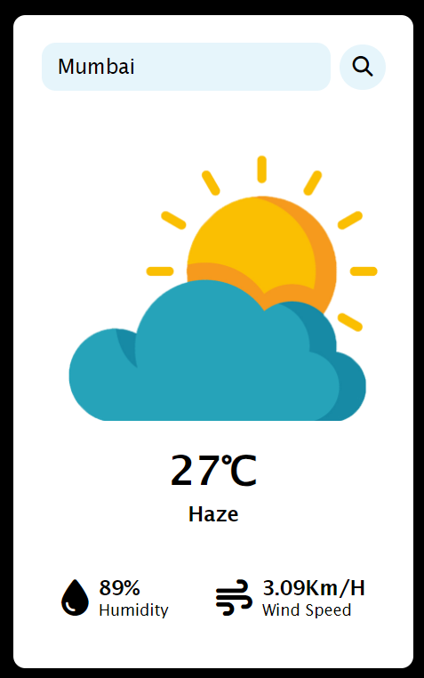

# WeatherApp

- **Real-time Weather Data**: Fetches and displays the latest weather information for any city using the OpenWeatherMap API.
- **Dynamic Weather Images**: Changes weather images based on current weather conditions such as clouds, clear skies, rain, mist, and snow.
- **User-friendly Interface**: Simple and intuitive interface for easy navigation and usage.

This Weather Application is a simple web-based tool that provides real-time weather information for cities worldwide. By leveraging the OpenWeatherMap API, the application fetches and displays current weather details such as temperature, weather description, humidity, wind speed, and a corresponding weather icon.

Features
Real-Time Weather Data: Get the latest weather information by simply entering the name of a city.
Dynamic Weather Icons: Displays weather images based on conditions such as cloudy, clear, rainy, misty, and snowy weather.
User-Friendly Interface: Easy-to-use interface with a search functionality to quickly find weather details for any city.
Usage
Enter a City: Type the name of the city you want to check in the search box.
View Weather Details: Click the "Search" button to view the temperature, weather description, humidity, wind speed, and a relevant weather icon.
Configuration
To use the application, you need an API key from OpenWeatherMap. Replace the api_key variable in script.js with your API key: